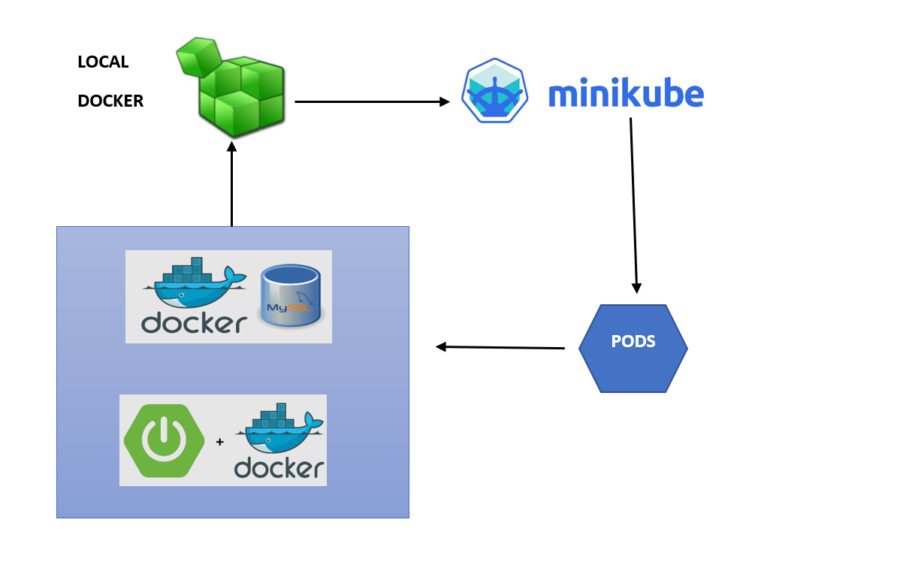
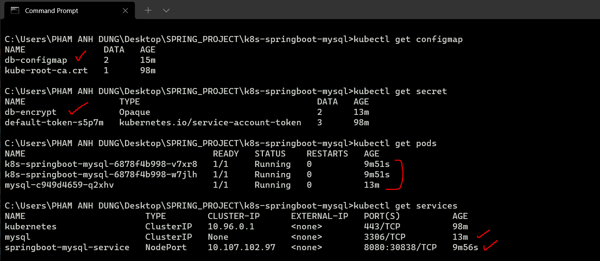
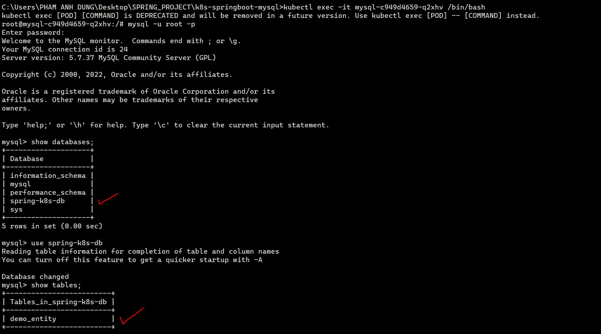
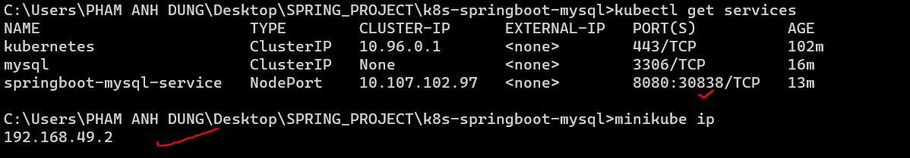

## Kubernetes SpringBoot MySQL
Demo Video: https://youtu.be/YYtc5NCL7lk

## Minikube Environment
* minikube docker-env
* @FOR /f "tokens=*" %i IN ('minikube -p minikube docker-env --shell cmd') DO @%i

## MySQL && SPRINGBOOT

* kubectl apply -f db-configMap.yml
* kubectl apply -f db-encrypt.yml
* kubectl apply -f db-mysql.yml

* docker build -t k8s-springboot-mysql:1.0 .
* kubectl apply -f k8s-springboot-mysql.yml 

## Result
* Kubernetes services: 

* MySQL SpringBoot Hibernates

* Service access
minikube ip
kubectl get services

Get minikube IP and TCP port, you can access to spring boot application. 

